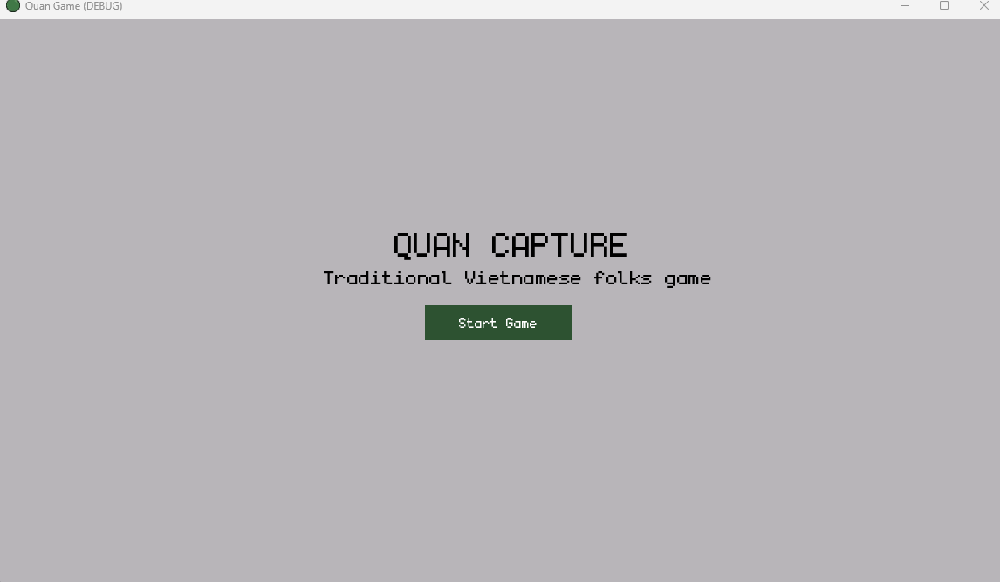

## Quan Capture Game
This is the traditional Vietnamese folks game ([Ô Ăn Quan](https://en.wikipedia.org/wiki/%C3%94_%C4%83n_quan)), made in Godot for learning. Currently, it can only be played with 2 humans, playing against NPC and a tutorial is on the TODO list.

Assets used:

* [Monogram font](https://datagoblin.itch.io/monogram).
* The rest is self-made.
